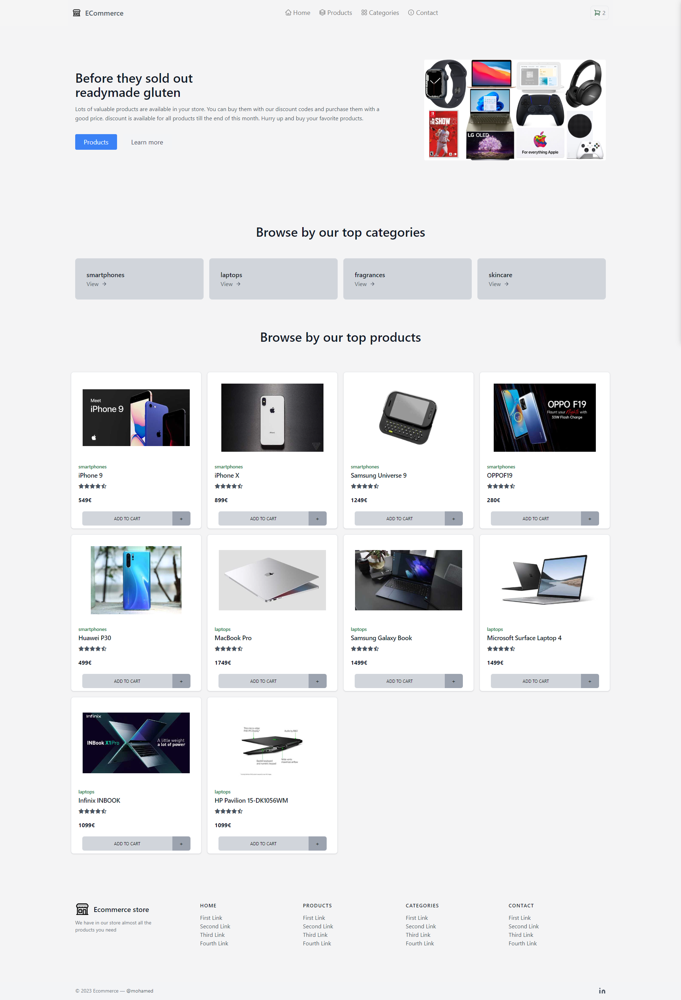
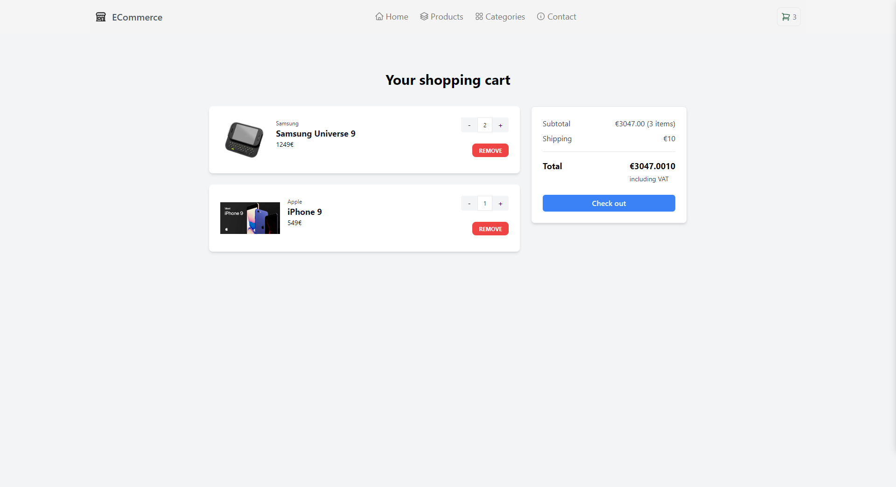
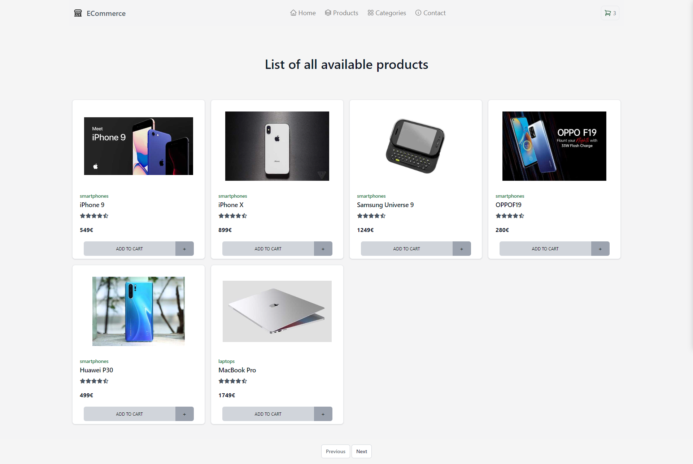

# Ecommerce Store API





## Ecommerce Store Application

- This application is a simple  simulation of an e-commerce service, such as the purchase of goods and services, over an electronic network, primarily the Internet. These business transactions occur business-to-consumer (B2C)


## Features

- Add to cart
- Remove from cart
- Top categories
- Top products
- Pagination

## Next tasks

- Add Search functionality

## Installation & Usage

### Normal setup

1- Clone the repo

```bash
https://github.com/capo33/ecommerecV1
```

2- Install dependencies

- in the root directory run the command

```bash
yarn
```

3- Run the application

```bash
yarn run dev
```

### Go live

```bash
https://ecommerce-shop-v1.netlify.app/
```
 
## Tech stack

- [React]
- [Redux]
- [Redux-Toolkit]
- [Typescript]

## Styles

- [Tailwind-CSS]
- [Hero-Icons]

[React]: https://mui.com/
[Redux]: https://redux.js.org/tutorials/typescript-quick-start/
[Redux-Toolkit]: https://redux-toolkit.js.org/
[Typescript]: https://www.typescriptlang.org/
[Tailwind-CSS]: https://tailwindcss.com/
[Hero-Icons]: https://heroicons.com/
